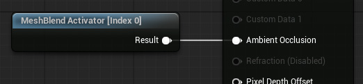
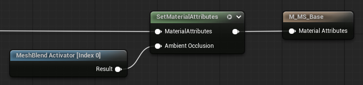
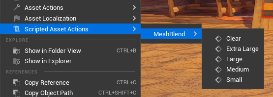
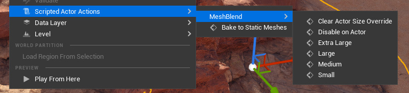
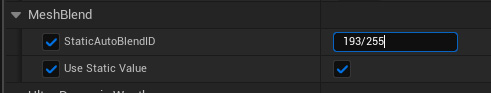

# Setup

> [!WARNING] VIDEO GUIDE
> Please watch the whole video **BEFORE** following the steps below. 
> <br>
> The setup process is complex and things are easy to miss!
> <br>
> <br>
> 
> <a href="https://www.youtube.com/watch?v=C8bxiYUE8TE" target="_blank" class="fabLink">Watch Getting Started Video</a>


### Setup will go through the following

1. Enable the plugin
2. Update DefaultEngine.ini
3. Patch engine shaders
4. Add MeshBlend Activator Actor to level
5. Update Materials
6. Blend meshes

**Each step is required to setup the plugin.<br>Make sure you follow the setup guide word for word. Some things are easy to miss.**

## 1. Enable plugin

- Enable **MeshBlend** plugin for project
- Restart editor

> [!NOTE] Editor Toolbar
> You should see a B in the editor toolbar after restart.
> <br>
> <br>
> 


## 2. Update DefaultEngine.ini

- Open `<project>/Config/DefaultEngine.ini`
- Find the `[/Script/Engine.RendererSettings]` section
- Add the following console variables
```
r.AllowStaticLighting=False
r.Lumen.ScreenProbeGather.MaterialAO=0
```

> [!WARNING] NOTE
> These changes are needed so that the plugin doesn't make meshes darker, since it's using the AO channel for data.

## 3. Patch engine shaders

Use the shader patcher tool to make sure the material Ambient Occlusion channel doesn't affect Unreals lighting while using MeshBlend.

- Open the **MeshBlend toolbar** and **Readme**
- Click **Open Shader Patcher Tool** in the bottom left corner
- Click **Apply All**
- Click **Restart Editor**

<video controls src="./MeshBlend_Shader_Patcher.mp4" autoplay muted loop />

## 4. Add MeshBlend Activator Actor to level

The Activator ensures each mesh is assign a correct blend ID. There should be one, and only one of this actor in your level at any time.

- Add the `/Plugins/MeshBlend Content/BP_MeshBlend_Activator` blueprint to your level.

## 5. Update Materials

**Example using a normal material**


**Example using a material that uses material attributes**


---

**The material needs to be updated for a mesh to blend.**

1. Add the `MeshBlend_Activator [Index X]` material function to your material and hook it up to the correct output channel. (Default is Ambient Occlusion)
2. Disconnect anything going to the AO in materials that are not blending (characters, items, etc). If not, they will show up in the MeshBlend debug view.

> [!WARNING] NOTE
> Make sure you connect the function to the **final output channel** of the material.

> [!NOTE] Custom Primitive Data
> The index on the material function corresponds to the Custom Primitive Data index it is supposed to use. If your material is already using CPDs you need to duplicate the material function and modify it to use an available index.

> [!NOTE] Blend ID
> At it's core the MeshBlend shader works on a grayscale mask where each mesh has a value (0 - 255) that holds the blend size and unique ID.
> 
> The activator blueprint ensures each mesh gets a value that is not overlapping with any intersecting meshes, since we only have a limited number of values to choose from.
> 
> Read more about this in [Rules of Blending](</Knowledgebase/Rules of Blending.md>).

## 6. Blend meshes

Now that the project is setup you can make a mesh blend. There are multiple ways to achieve this.

### A - Mesh Assets

> [!WARNING] VIDEO GUIDE
> Shown at 2:32 in the [Getting started video](https://www.youtube.com/watch?v=C8bxiYUE8TE&t=152s).



- Go to the mesh in your content browser that you want to blend
- Right click and choose `Scripted Asset Actions -> MeshBlend` and choose a size
- Any affected meshes in your level will automatically refresh

> [!NOTE] Asset User Data
> This helper function stores the size on the mesh asset as a Asset User Data. You can also edit it manually in the asset.

### B - Mesh Actors

> [!WARNING] VIDEO GUIDE
> Shown at 4:12 in the [Getting started video](https://www.youtube.com/watch?v=C8bxiYUE8TE&t=252s).



- Find the mesh in your level you want to blend
- Right click and choose `Scriptet Actor Actions -> MeshBlend` and choose a size

> [!NOTE] Actor Tag
> This helper function stores the size on the mesh asset as a Tag on the actor.
> <br>
> <br>
> You can also set these directly in the Actor or Component Tags
> <br>
> Tag names are:
>
> ```
> AutoBlend_Small
> AutoBlend_Medium
> AutoBlend_Large
> AutoBlend_ExtraLarge
> AutoBlend_Disabled
> ```

### C - Static blend ID on material

> [!WARNING] VIDEO GUIDE
> Shown at 1:01 in the [Getting started video](https://www.youtube.com/watch?v=C8bxiYUE8TE&t=61s).

> [!NOTE]
> Only use this approach when you need to. In most cases it's usually better to set it on the mesh [asset](#a-mesh-assets) or [actor](#b-mesh-actors) directly.



You can set a static blend ID on a material. This is required by some meshes like landscapes and landscape grass. It can also be used to make multiple meshes appear like one mesh to the plugin, causing them to not blend between each other.

The static values are values not used by the activator. So we can safely use these manually.

> [!WARNING] NOTE
> Meshes with the same static ID will never blend with each other.
> <br>
> <br>
> So use this feature for stuff that either need a static ID (like landscape), or when you don't need the mesh to blend with other meshes of the same type. (like foliage where you want it to blend with the ground, but don't need each flower to blend with each other.)

- Open the material instance
- Set `MeshBlend / Use Static Value` to `true`
- Set `MeshBlend / StaticAutoBlendID` to a corresponding value.

> [!NOTE] Static blend ID
> Static blend IDs for landscape, foliage & special cases (Remember to divide by 255 in parameter input)
> <br>
> Examples: 2/255 or 5/255 give a small blend, 67/255 gives a medium blend, etc.
> ```
> Small:       2-6
> Medium:      65-69
> Large:       128-132
> Extra Large: 191-195
> 
> ALWAYS REMBER TO DIVIDE THIS NUMBER BY 255 WHEN INPUTING IT
> ```

> [!NOTE] Static/Dynamic activation
> Landscape and Landscape Grass are not dynamically activated and need to have a static ID set
> <br>
> It's also adviced to use static IDs on foliage to improve performance.