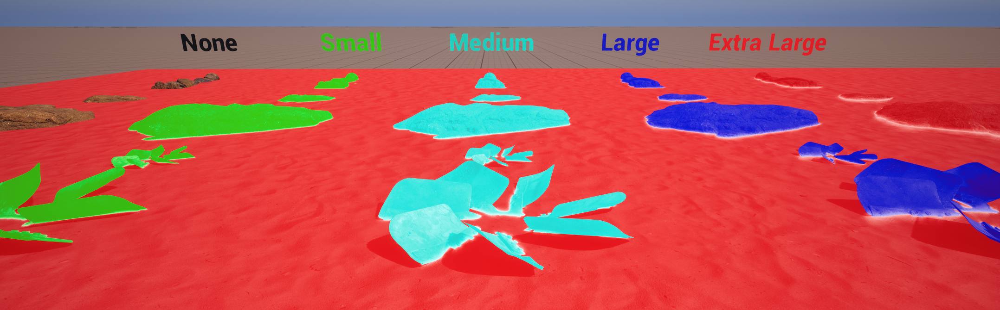

# Blend Sizes



There are 4 size presets you can assign to a mesh. Small, Medium, Large and Extra Large. 
The blend sizes are (almost) equal to centimeters when two blending meshes lay flat next to each other. (*Intersection angle, noise, contrast, etc all affect the final blend size displayed on screen.*)


> [!NOTE] Debug View
> 
> <br>
> In debug view each size is colored to visualize what blend size the mesh has.
> <br>
> `Small=Green` `Medium=Cyan` `Large=Blue` `Extra Large=Red`
> <br>
> <br>
> When two different size meshes blend, the smaller of the two sizes is used on both sides of the seam.

## Blend Presets

There are 4 preset sizes you can assign to a mesh. Small, Medium, Large and Extra Large.

> [!NOTE]
> Think of the sizes are categories. Your project might want to use small for "weld small items", while other will use small for "pebbles and small rocks". You have 4 general categories you can group you mesh assets in.

### Changing sizes

The blend sizes can be changed with cvars. Here are the default values.

```
r.MeshBlend.Small.Size 6
r.MeshBlend.Medium.Size 10
r.MeshBlend.Large.Size 20
r.MeshBlend.ExtraLarge.Size 30
```

### Min Size

MinSize is a way to adjust the percived size of a blend. 

It takes some time getting "used to" thinking with min size.
<br>
With a MinSize of 2 the blend size will be the same visual size at 2000 units as it was at 1000 units.

Example A: `r.MeshBlend.Small.Size 3, r.MeshBlend.Small.MinSize 10` = Can be used as a small blend to reduce a seams without blending it. (Good for roads, concrete, hard surfaces). But it stays a small blend further away also.

Example B: `r.MeshBlend.ExtraLarge.Size 30, r.MeshBlend.ExtraLarge.MinSize 5` = Good for big cliffs. Up close the blend is ~30cm in world space, but 100 meter away it will be closer to 1,5 meters. This ensures the terrain seams stay blended when far away.

```
r.MeshBlend.Small.MinSize 1.5
r.MeshBlend.Medium.MinSize 3
r.MeshBlend.Large.MinSize 3
r.MeshBlend.ExtraLarge.MinSize 5
```