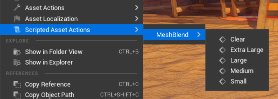
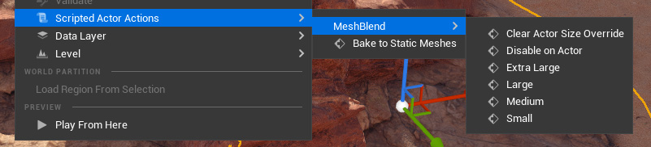
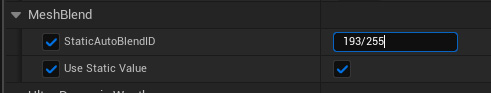

# Using MeshBlend

## Update Material

The material needs to be updated for a mesh to blend.

1. Add the `MeshBlend_Activator [Index X]` material function to your material and hook it up to the correct output channel. (Default is Ambient Occlusion)
2. Disconnect anything going to the AO in materials that are not blending (characters, items, etc). If not, they will show up in the MeshBlend debug view.

> [!NOTE] Custom Primitive Data
> The index on the material function corresponds to the Custom Primitive Data index it is supposed to use. If your material is already using CPDs you need to duplicate the material function and modify it to use the correct index.

## Blend meshes

Now that the project is setup you can make a mesh blend. There are multiple ways to achieve this.

### A - Mesh Assets



- Go to the mesh in your content browser that you want to blend
- Right click and choose `Scripted Asset Actions -> MeshBlend` and choose a size
- Any affected meshes in your level will automatically refresh

> [!NOTE] Asset User Data
> This helper function stores the size on the mesh asset as a Asset User Data. You can also edit it manually in the asset.

### B - Mesh Actors



- Find the mesh in your level you want to blend
- Right click and choose `Scriptet Actor Actions -> MeshBlend` and choose a size

> [!NOTE] Actor Tag
> This helper function stores the size on the mesh asset as a Tag on the actor.
> <br>
> <br>
> You can also set these directly in the Actor or Component Tags
> <br>
> Tag names are:
>
> ```
> AutoBlend_Small
> AutoBlend_Medium
> AutoBlend_Large
> AutoBlend_ExtraLarge
> AutoBlend_Disabled
> ```

### C - Static blend ID on material



You can set a static blend ID on a material. This is required by some meshes like landscapes and landscape grass. It can also be used to make multiple meshes appear like one mesh to the plugin, causing them to not blend between each other.

> [!WARNING] NOTE
> Meshes with the same static ID will never blend with each other.
> <br>
> <br>
> So use this feature for stuff that either need a static ID (like landscape), or when you don't need the mesh to blend with other meshes of the same type. (like foliage where you want it to blend with the ground, but don't need each flower to blend with each other.)

- Open the material instance
- Set `MeshBlend / Use Static Value` to `true`
- Set `MeshBlend / StaticAutoBlendID` to a corresponding value.

> [!NOTE] Static blend ID
> Static blend IDs for landscape, foliage & special cases (Remember to divide by 255 in parameter input)
> <br>
> Examples: 2/255 or 5/255 give a small blend, 67/255 gives a medium blend, etc.
> ```
> Small:       2-6
> Medium:      65-69
> Large:       128-132
> Extra Large: 191-195
> 
> ALWAYS REMBER TO DIVIDE THIS NUMBER BY 255 WHEN INPUTING IT
> ```

> [!NOTE] Static/Dynamic activation
> Landscape and Landscape Grass are not dynamically activated and need to have a static ID set
> <br>
> It's also adviced to use static IDs on foliage to improve performance.