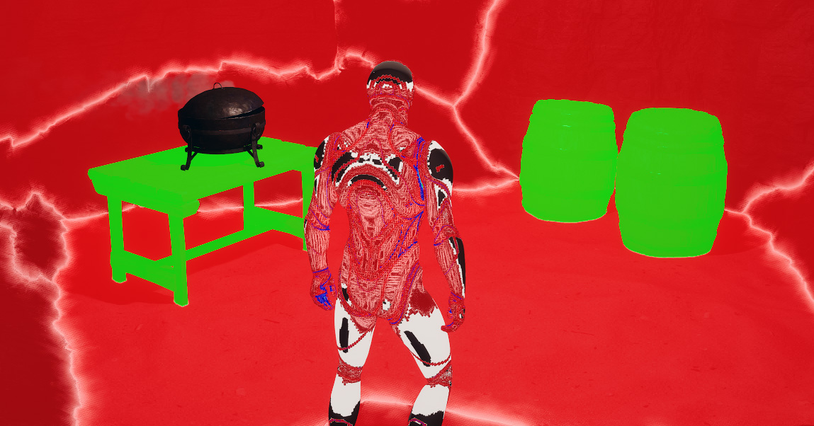
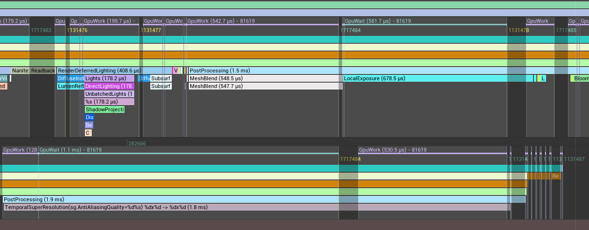

# Performance

## How many meshes can it blend?
MeshBlend is a screen space effect, so the amount of meshes being blended isn't a big factor. You can have 5 or 5.000.000 blended meshes in your scene without much performance impact.

## Shader performance
Shader cost is ~0.2-0.4 ms on an average PC at 1440p render resolution. There are 4 quality presets targeting offline rendering and high end PC down to Xbox Series S/low end PCs, so this can be tuned to preference.

For more exact performance numbers it's recommended to download the [playable demo](</Playable Demo.md>) and profile it using Unreal Insight.

> [!NOTE] PROFILING
> The demo project is built with debug so you can profile it using Unreal Insight.
>  
> MeshBlend also shows up in Stat GPU

### Profiling considerations

When profiling the performance of MeshBlend there are some things that can give inaccurate results.

#### 1. Meshes with AO still active

Materials that still have AO can make the shader think every single pixel on that mesh is an individual mesh that needs blending. Use the debug view to ensure no mesh in the scene is "sparkling".

#### 2. Async GPU work

Use Unreal Insight the check if any async GPU work is running parallel. `r.TSR.AsyncCompute 3` is one example that makes the TemporalSuperResolution run at the same time as MeshBlend and other Post Process effects. This might speed up the overall FPS, but it makes it impossible to evaluate the frametime for MeshBlend accurately.

### UE5.6 improvements

The plugin needs to do a texture copy when running in Unreal prior to 5.6. This has a tiny performance hit.

This can be backported by integrating [this commit](https://github.com/EpicGames/UnrealEngine/commit/05e5b6e255da2306d831741e263f912cd1697eec) and modifying the FMeshBlendSceneViewExtension so it executes the SubscribeToPostProcessingPass function.

## Actor performance
The plugin has a MeshBlend Activator Actor that runs in the level. 
- In editor this is restricted to a max ms budget (default: 0.3 ms)
- In packaged game most of the work is pre-calculated on packaging, so it generally just idles.