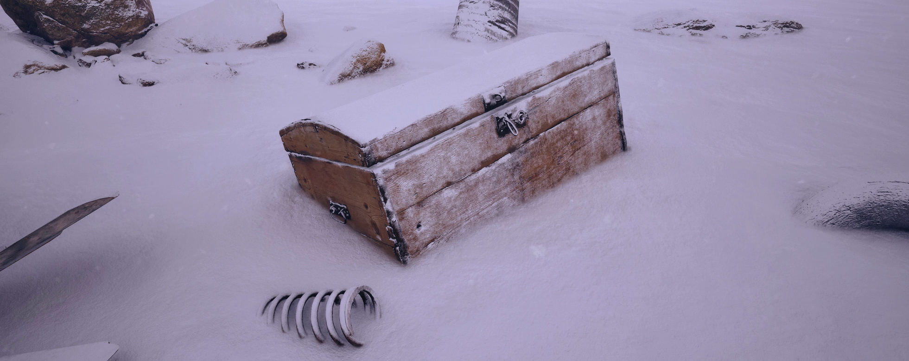

# MeshBlend

MeshBlend is an Unreal Engine plugin enabling controllable blending of meshes. It's been battle tested and is used in real projects with different art styles and requirements ranging from Indie to AAA titles.

MeshBlend supports a wide range of scenarios and delivers a visually pleasing result at great performance!

Games, offline rendering cinematics and virtual production in Unreal are all supported. At its core MeshBlend balances performance, visual quality and artist workflow.

**If it's a mesh, we can blend it**

## Where to buy

MeshBlend is not yet available. It will release on Fab soon! 
 
Join [Discord](https://discord.gg/sX48CssHWM) or follow me on [Bluesky](https://bsky.app/profile/hallatore.bsky.social) or [Twitter](https://x.com/toreler) to be notified when it launches!

## Playable demo

The demo showcases different usages and allows you to evaluate visual quality as well as performance.

[Download link](https://drive.google.com/file/d/1BOzZkNZaa3oVsfl1yqchq9VoSyjKFb1F/view)

## Discord Community

I've made a Discord where people can ask and chat about all things blending.

<iframe src="https://discord.com/widget?id=1279047221362294964&theme=dark" width="350" height="500" allowtransparency="true" frameborder="0" sandbox="allow-popups allow-popups-to-escape-sandbox allow-same-origin allow-scripts"></iframe>